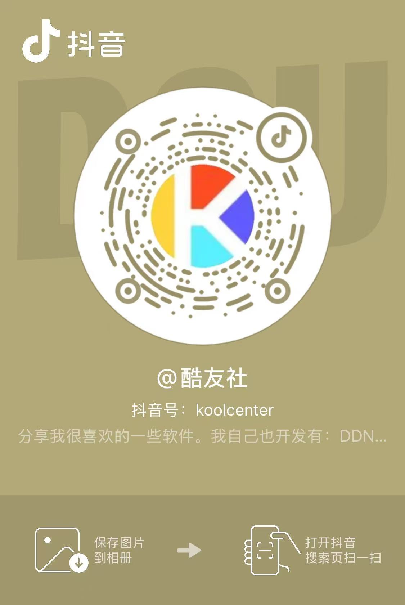

### 每周二、四 19:30，宝哥与你相约直播间！ 

#### 酷友社论坛已经上线！ https://www.koolcenter.com 
#### 欢迎大家加入论坛，交流分享，探索更多乐趣！ 

## 设备预览

目前 [ASUSGO官网](https://www.asusgo.com/firmware) 固件支持机型一览表，附带最新改版固件版本号。

**WiFi7 设备**

| 型号 | 型号 | 型号 | 型号 |
|------|------|------|------|
| [GT-BE96](https://www.asusgo.com/firmware/download?devicename=gt-be96&firmware=asus_official) <small>102_37421</small> | [ROG 魔盒Pro(GS7_PRO)](https://www.koolcenter.com/t/topic/877) <small>102_38498</small> | [ROG 魔盒(GS7)](https://www.asusgo.com/firmware/download?devicename=gs7&firmware=asus_official) <small>102_56929_r1</small> | [RT-BE88U](https://www.asusgo.com/firmware/download?devicename=rt-be88u&firmware=merlin) <small>102.4_0</small> |
| [RT-BE86U](https://www.asusgo.com/firmware/download?devicename=rt-be86u&firmware=merlin) <small>102.4_0</small> | [RT-BE82U](https://www.asusgo.com/firmware/download?devicename=rt-be82u&firmware=asus_official) <small>102_38152</small> | [TUF-BE6500](https://www.asusgo.com/firmware/download?devicename=tuf-be6500&firmware=asus_official) <small>102_54701</small> | [TUF-BE3600](https://www.asusgo.com/firmware/download?devicename=tuf-be3600&firmware=asus_official) <small>102_34193</small> |
| [ZENWIFI_BD4](https://www.asusgo.com/firmware/download?devicename=zenwifi_bd4&firmware=asus_official) <small>102_56735</small> |

**WiFi6 设备**

| 型号 | 型号 | 型号 | 型号 |
|------|------|------|------|
| [GT-AX11000_PRO](https://www.asusgo.com/firmware/download?devicename=gt-ax11000_pro&firmware=merlin) <small>102.4_0</small> | [GT-AX11000](https://www.asusgo.com/firmware/download?devicename=gt-ax11000&firmware=merlin) <small>388.9_2</small> | [GT-AX6000](https://www.asusgo.com/firmware/download?devicename=gt-ax6000&firmware=merlin) <small>102.4_0</small> | [ROG 魔方幻(GT6)](https://www.asusgo.com/firmware/download?devicename=gt6&firmware=asus_official) <small>388_23145</small> |
| [RT-AX92U](https://www.asusgo.com/firmware/download?devicename=rt-ax92u&firmware=merlin) <small>388.8_4</small> | [RT-AX89X](https://www.asusgo.com/firmware/download?devicename=rt-ax89x&firmware=asus_official) <small>388_32407</small> | [RT-AX88U_PRO](https://www.asusgo.com/firmware/download?devicename=rt-ax88u_pro&firmware=merlin) <small>102.4_0</small> | [RT-AX88U](https://www.asusgo.com/firmware/download?devicename=rt-ax88u&firmware=merlin) <small>388.9_2</small> | 
| [RT-AX86U_PRO](https://www.asusgo.com/firmware/download?devicename=rt-ax86u_pro&firmware=merlin) <small>102.4_0</small> | [RT-AX86U](https://www.asusgo.com/firmware/download?devicename=rt-ax86u&firmware=merlin) <small>388.9_2</small> | [RT-AX82U_V2](https://www.asusgo.com/firmware/download?devicename=rt-ax82u_v2&firmware=merlin) <small>388.8_4</small> | [RT-AX82U](https://www.asusgo.com/firmware/download?devicename=rt-ax82u&firmware=merlin) <small>388.8_4</small> |
| [RT-AX68U](https://www.asusgo.com/firmware/download?devicename=rt-ax68u&firmware=merlin) <small>388.9_2</small> | [RT-AX58U](https://www.asusgo.com/firmware/download?devicename=rt-ax58u&firmware=merlin) <small>388.9_2</small> | [RT-AX57_GO](https://www.asusgo.com/firmware/download?devicename=rt-ax57_go&firmware=asus_official) <small>102_22108</small> | [RT-AX57](https://www.asusgo.com/firmware/download?devicename=rt-ax57&firmware=asus_official) <small>386_50460</small> |
| [RT-AX56U_V2](https://www.asusgo.com/firmware/download?devicename=rt-ax56u_v2&firmware=asus_official) <small>386_49559</small> | [RT-AX56U](https://www.asusgo.com/firmware/download?devicename=rt-ax56u&firmware=merlin) <small>388.8_4</small> | [TX-AX6000](https://www.asusgo.com/firmware/download?devicename=tx-ax6000&firmware=asus_official) <small>388_33405</small> | [TUF-AX5400_V2](https://www.asusgo.com/firmware/download?devicename=tuf-ax5400_v2&firmware=asus_official) <small>388_22525</small> |
| [TUF-AX5400](https://www.asusgo.com/firmware/download?devicename=tuf-ax5400&firmware=merlin) <small>388.8_4</small> | [TUF-AX4200](https://www.asusgo.com/firmware/download?devicename=tuf-ax4200&firmware=asus_official) <small>388_33147</small> | [TUF-AX3000_V2](https://www.asusgo.com/firmware/download?devicename=tuf-ax3000_v2&firmware=merlin) <small>388.8_4</small> | [TUF-AX3000](https://www.asusgo.com/firmware/download?devicename=tuf-ax3000&firmware=merlin) <small>388.8_4</small> |
| [ZENWIFI-PRO-XT12](https://www.asusgo.com/firmware/download?devicename=zenwifi-pro-xt12&firmware=merlin) <small>102.4_0</small> | [ZENWIFI-XT9](https://www.asusgo.com/firmware/download?devicename=zenwifi-xt9&firmware=asus_official) <small>388_21963</small> | [ZENWIFI-XT8](https://www.asusgo.com/firmware/download?devicename=zenwifi-xt8&firmware=merlin) <small>388.8_4</small> | [ZENWIFI-XD4](https://www.asusgo.com/firmware/download?devicename=zenwifi-xd4&firmware=asus_official) <small>386_49599</small> | 

**WiFi5 设备**

| 型号 | 型号 | 型号 |
|------|------|------|
| [GT-AC5300](https://www.asusgo.com/firmware/download?devicename=gt-ac5300&firmware=asus_official) <small>386_48377</small> | [GT-AC2900](https://www.asusgo.com/firmware/download?devicename=gt-ac2900&firmware=merlin) <small>386.10_0</small> | [RT-AC86U](https://www.asusgo.com/firmware/download?devicename=rt-ac86u&firmware=merlin) <small>386.10_0</small> |
