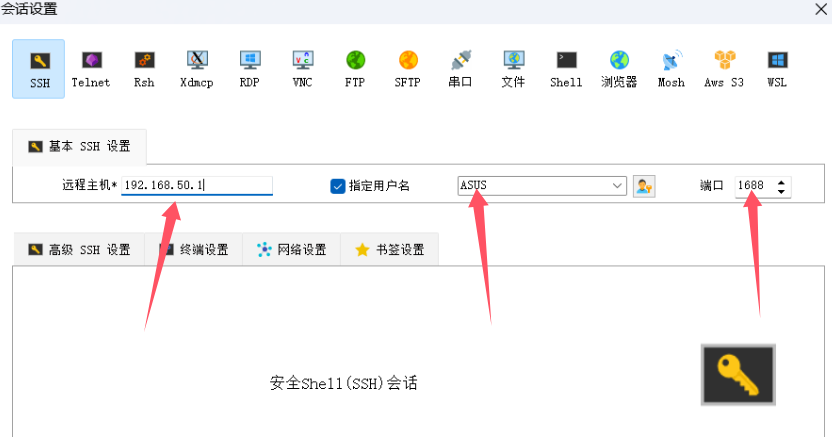
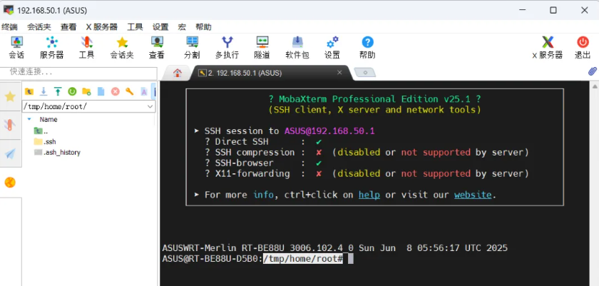

### 重要命令
以下操作需要使用支持SSH协议的软件，连接到路由器后台进行操作，如果不会使用，可以参考下面步骤：

#### 一、启用 SSH： 
* 在路由器后台的【系统管理】-【系统设置】里，将【启用 SSH】更改为LAN only，将端口号设置为22或者其它数字，点击页面下方【应用本页面设置】保存更改；

#### 二、登录 SSH： 
* 下载SSH软件，如 putty、xhsell、MobaXterm 等，运行后在远程主机(IP)处输入路由器的IP地址，如：192.168.50.1；用户名为路由登录用户名；端口为上一步中【SSH 端口】中的端口，如果没有更改，则为22；下一步弹窗提示输入密码（password：）输入路由器登录密码，完成登录。





#### 三、键入命令： 
* 键入命令时建议将系统输入法切换为英文，也可以复制命令后使用右键即可粘贴命令，粘贴完毕后按回车即可执行命令。
* 开启路由器SSH功能后，通过 putty、xhsell、MobaXterm 等SSH软件连接路由器，直接在SSH客户端内运行命令即可。


#### 1. 重启软件中心
当软件中心相关进程挂掉的时候，软件中心版本号显示0.0.0，或者一直显示更新中，输入以下命令重启软件中心：
```
sh /koolshare/perp/perp.sh
```

#### 2. 软件中心重置
让软件中心恢复到初始状态，请注意：此操作会删除所有已安装插件！，输入以下命令重置软件中心：
```
koolshare-reset
```

#### 3. 清空jffs空间
注意，此操作会删除jffs分区内的所有文件，包括但不限于：软件中心、安装的证书、TrafficAnalyzer的数据库、自定义的设备图标等。
```
kill -9 $(pidof skipd)
cd /jffs && rm -r .[a-zA-Z_]* *
reboot
```

#### 4. 删除软件中心
适用于官改固件刷回原厂固件，需要删除留在jffs分区内软件中心，而不删除其它文件。
如果是在官改固件下删除软件中心，重启路由，路由会自动重新安装软件中心。
```
kill -9 $(pidof skipd)
cd /jffs
rm -rf .asusrouter .koolshare db ksdb config/* etc/profile scripts/*
reboot
```
