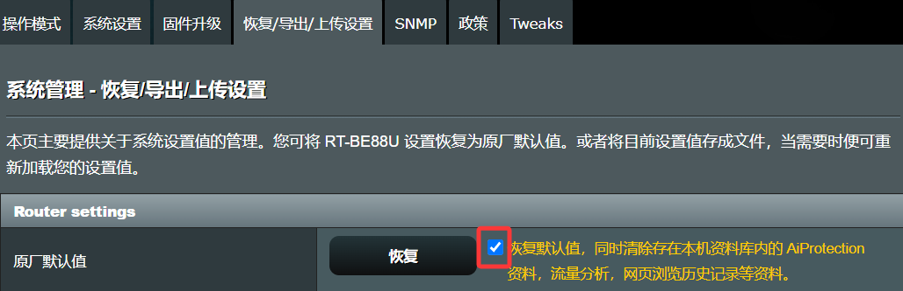
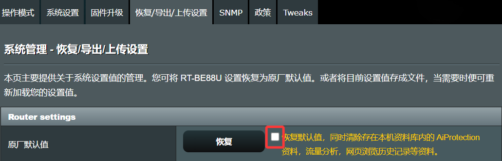

### 刷机术语
* 为消除部分新手在刷机过程中的疑惑，下面列出一下华硕/梅林固件刷机的基本术语，希望对大家有所帮助。

* 如果你对下面的内容已经比较清楚，那么可以跳过这部分直接进入到刷机流程。

#### 一、固件双清：双清就是要清除：1、nvram 配置，2、JFFS 分区文件。

* 1.1：固件的很多设置都是储存在 nvram 中，例如拨号方式、拨号上网帐号密码、无线网络设置等；固件也有一些文件是储存在 JFFS 分区的，例如流量分析储存的流量数据，SSL 证书，UU 加速器程序等。
* 1.2：一般同类型固件互刷不需要进行双清，不同类型固件互刷视情况要进行双清，以保证路由器刷机后处于最佳工作状态。
* 1.3：如何双清路由器：
```
进入【系统管理】–【恢复/导出/上传设置】，勾选恢复按钮旁的选择框，然后点击【恢复】按钮。
```


#### 二、恢复出厂：恢复出厂就是只清除固件的 nvram 配置，但是不清除 JFFS 分区文件，这样流量分析、SSL 证书等文件并不会丢失。

* 2.1：值得注意的是很多朋友用【导出设置】来备份固件配置的习惯，而在刷固件，特别是不同类型固件互刷的情况下，是不适用使用备份的配置来恢复刚刚进行了恢复出厂的机器的，因为这样就相当于你什么也没恢复。所以请一定不要使用以前备份的配置来恢复刚刷机后，又进行过恢复出厂的路由器。
* 2.2：使用【导出设置】备份的配置文件，一般进行了一些设置导致路由器出了问题，将路由器恢复到原厂默认值后，再用备份配置进行恢复，使用备份配置前后，路由器都是同一个固件版本。
* 2.3：如何恢复出厂：
```
进入【系统管理】–【恢复/导出/上传设置】，记住不要勾选恢复按钮右侧的选择框，然后点击【恢复】按钮。
```
