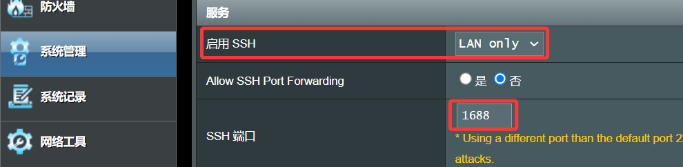
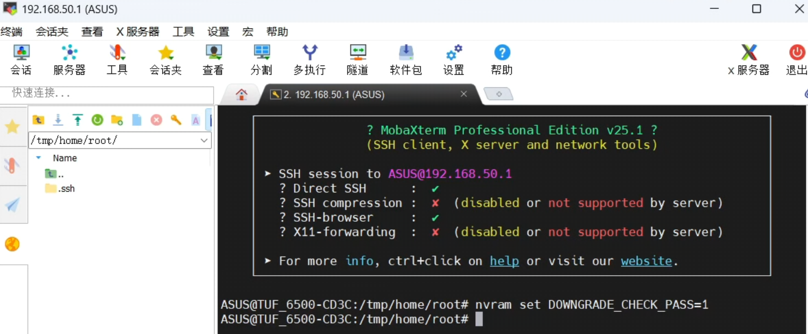
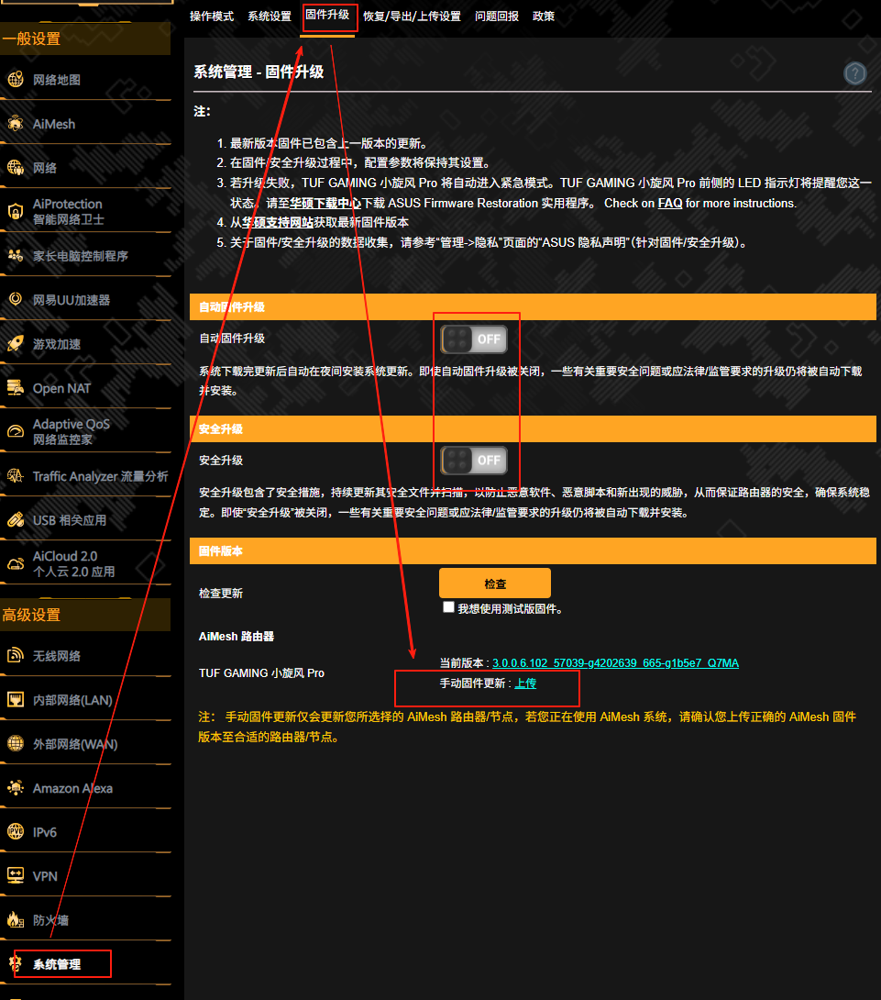

### 开始刷机

#### A. 原厂固件 → 改版固件：
* 如无特殊说明，刷机完成后不用恢复出厂设置，建议恢复一次更好！
* 重启后先将路由器连上网络，然后进入软件中心将软件中心更新到最新版本。

#### B. 改版固件 → 原厂固件：
* 刷机完成后固件恢复为官方固件，但是JFFS分区仍然会保留有一些软件中心相关文件；
* 建议执行一次固件双清：恢复出厂时（勾选恢复按钮旁边的选择框），这样将清空JFFS内除软件中心外的其它文件。
* 或者参考下文重要命令里的删除软件中心，将JFFS内残留的软件中心文件删除。

#### C. 救援模式
* 因为救援模式的存在，加上华硕路由器的固件是双分区结构，所以华硕路由器刷机理论上是刷不死的，即使刷机过程中停电都刷不死！只要开机后有灯亮，那么出现任何无法启动的问题都是能救得活的。
* 查看[官方救援模式教程](https://mp.weixin.qq.com/s/zMTRnGBGwnkKbA2fUJar0Q)。

#### D. 降级检测
* 目前众多机型最新官方固件 **（3006.102_37000及更高版本）** 有降级检测机制，统一建议：刷入改版固件前，利用 SSH 关闭固件降级检测！
* 查看[重要命令](/zh/guide/asus/flash/flash_command.html)如何启用/使用 SSH；
* **SSH 登录路由器后台后输入命令：**
```
nvram set DOWNGRADE_CHECK_PASS=1
```



* TUF-BE6500 比较特殊，SSH 解除命令无效，需利用 **[官方救援模式](https://mp.weixin.qq.com/s/zMTRnGBGwnkKbA2fUJar0Q)** 降级初版官方固件后刷入。

#### E. 开始刷机

* 【系统管理】–【固件升级】，关闭自动固件升级+安全升级，底部【上传】选择下载的 [ASUSGO固件](https://www.asusgo.com/firmware) 文件；



* 上传完毕后开始升级；升级过程中会断网 大约三分钟后重新进入华硕路由器后台。


